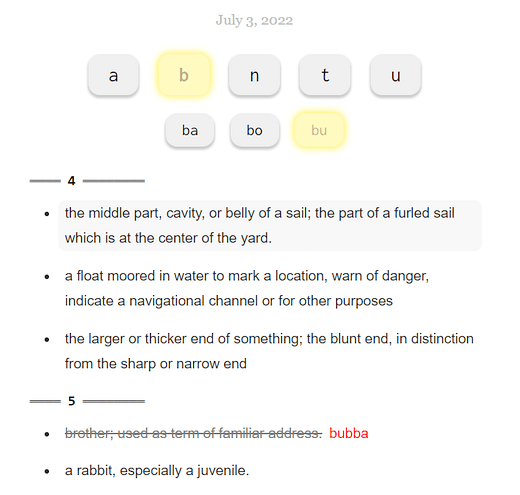

# Spelling Bee Clue Generator

A web app to generate clues for today's Spelling Bee puzzle from Wiktionary definitions. Includes a React front-end and an AWS back-end that hosts a static page in an S3 bucket behind a CloudFront distribution. The back-end also uses a Lambda function that is run daily to scrape the newest game data.

## Installation

In `frontend/`, do `npm ci && npm run webpack`. 

In `backend/`, do `terraform apply`. Set the `automatic_invalidation` variable if you want the CloudFront distribution caches cleared.

## Usage

Clues are divided by the first and second letters of the answer. Clicking a clue will strike it and reveal the answer.
